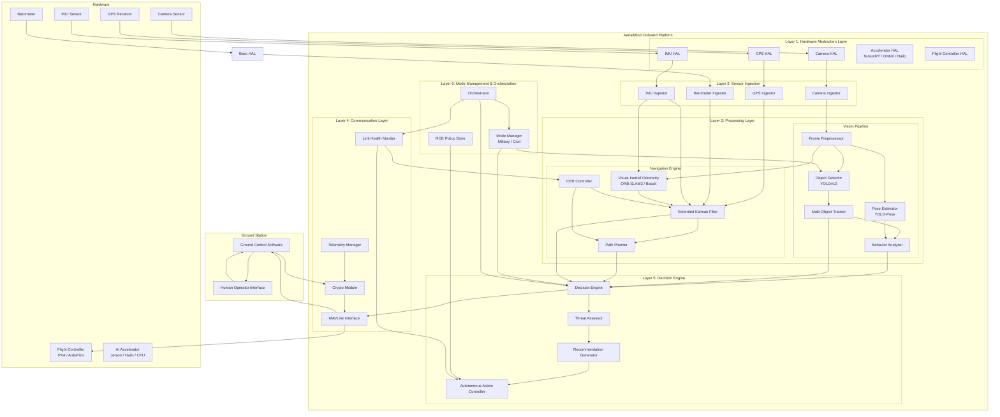

# System Architecture Overview

AerialMind is a 6-layer software stack that runs on a companion computer mounted on a drone. It sits between the physical sensors (camera, IMU, GPS) and the flight controller, adding an AI brain that understands what the drone sees and makes intelligent decisions.

## Why This Architecture?

Most drone software is tightly coupled to specific hardware — change the camera or swap the flight controller and you're rewriting code. AerialMind uses **layered abstraction** so each layer only talks to the one below it through standardized interfaces. This means:

- Swap the camera? Only the HAL layer changes.
- Switch from Jetson to Raspberry Pi? Only the accelerator provider changes.
- Add a new AI model? Drop it into the models folder — no code changes.

## The 6 Layers

| Layer | Name | Responsibility |
|---|---|---|
| 1 | **Hardware Abstraction Layer (HAL)** | Hides hardware differences behind uniform interfaces |
| 2 | **Sensor Ingestion** | Timestamps, calibrates, and buffers raw sensor data |
| 3 | **Processing** | Vision Pipeline (detect, track, analyze) + Navigation Engine (VIO, EKF) |
| 4 | **Communication** | MAVLink to flight controller, encrypted telemetry to ground station |
| 5 | **Decision Engine** | Threat assessment, recommendations, autonomous actions within ROE |
| 6 | **Mode Management & Orchestration** | Military/Civil mode switching, module lifecycle |

## High-Level Component Diagram



## How Data Flows Through the System

Here is the simplified flow from camera frame to action:

```
1. Camera captures a frame
      ↓
2. HAL normalizes it (fixes lens distortion, timestamps it)
      ↓
3. Vision Pipeline processes it:
   - Object Detector (YOLOv10): "I see 3 people, 1 vehicle"
   - Pose Estimator (YOLO-Pose): "Person #2 is raising arms to shoulder height"
   - Tracker (ByteTrack): "Person #2 is the same person from 30 frames ago, moving NE"
   - Behavior Analyzer: "Person #2 is brandishing a weapon (87% confidence)"
      ↓
4. Meanwhile, Navigation Engine runs in parallel:
   - GPS + IMU + Camera → EKF fuses into a single position estimate
   - If GPS is jammed → VIO takes over using camera + IMU only
      ↓
5. Decision Engine combines vision + navigation:
   - Threat Assessor: "Threat level ALERTING (score: 72)"
   - Recommendation: "Track closely, alert operator"
      ↓
6. If operator link is active → send recommendation, wait for approval
   If operator link is lost → check ROE policy, act autonomously if permitted
      ↓
7. Approved action → MAVLink command to flight controller
```

## Architectural Principles

### 1. Dependency Inversion

Every module depends on abstract interfaces (Python `Protocol` classes), never on concrete implementations.

**What this means in practice:** The Vision Pipeline calls `accelerator.infer(model, input)` — it doesn't know or care whether it's running on a $300 NVIDIA Jetson with TensorRT or a $50 Raspberry Pi with ONNX Runtime. The HAL handles that.

### 2. Event-Driven Core

Modules communicate via an internal message bus (publish-subscribe pattern). A module publishes an event ("weapon detected!") and any module that cares about that event receives it automatically.

**Why this matters:** If the Behavior Analyzer crashes, the Navigation Engine keeps running. If you add a new module later, it just subscribes to the events it needs — no rewiring.

### 3. Fail-Safe by Default

Every state machine defaults to the safest action. Examples:
- Decision Engine crashes → CER Controller commands return-to-safe-zone
- Vision Pipeline stalls → Navigation continues on IMU-only dead reckoning
- GPS is jammed → VIO takes over automatically
- Operator link lost → AI follows pre-approved ROE, then returns to base

### 4. Deterministic Scheduling

The processing pipeline runs on a fixed-priority real-time schedule to guarantee performance:

| Task | Target Rate | Why |
|---|---|---|
| EKF prediction (IMU) | 200-400 Hz | Drone stability requires high-frequency attitude updates |
| Camera frame capture | 30 fps | Raw sensor input |
| Object detection (YOLOv10) | 15 fps | Real-time detection — faster than human reaction |
| Pose estimation (YOLO-Pose) | 5 fps | Pose changes slower than position — save compute |
| Behavior analysis | 3 fps | Behaviors unfold over seconds, not milliseconds |

## Key Technologies Explained

### YOLOv10 (You Only Look Once, version 10)

An AI model that looks at a single image and instantly identifies all objects in it — people, vehicles, weapons — along with their positions (bounding boxes). "You Only Look Once" means it processes the entire image in one pass (unlike older methods that scanned the image region by region). Version 10 is optimized for edge devices like Jetson, running at 15+ fps.

### ORB-SLAM3 (Oriented FAST and Rotated BRIEF - Simultaneous Localization and Mapping)

A computer vision algorithm that tracks visual features (corners, edges) across camera frames to figure out where the camera is moving — without GPS. Think of it like a human navigating a room by watching how objects move as they walk. This is what powers GPS-denied flight.

### Extended Kalman Filter (EKF)

A mathematical algorithm that combines multiple noisy sensor readings (GPS says you're here, IMU says you're there, barometer says this altitude) into a single best estimate of your true position. It's the same algorithm used in every smartphone's GPS and every aircraft's autopilot. Our EKF tracks 15 states: position (3), velocity (3), attitude (3), gyroscope bias (3), and accelerometer bias (3).

### MAVLink (Micro Air Vehicle Link)

The universal communication protocol for drones. It's how the companion computer (running AerialMind) talks to the flight controller (running PX4/ArduPilot). Think of it as the "USB standard" for drones — any MAVLink-compatible device can talk to any MAVLink-compatible controller.

### ByteTrack

A multi-object tracking algorithm that assigns persistent IDs to detected objects across video frames. When YOLOv10 detects "a person" in frame 1 and "a person" in frame 2, ByteTrack figures out if it's the same person or a different one. This is essential for tracking suspects over time.

## What's Next

This document covered the high-level architecture. The remaining architecture docs cover each component in detail:

- [Module Specifications](02-module-specifications.md) — detailed interfaces for each module
- [Data Flow Diagrams](03-data-flow.md) — sequence diagrams showing message flow
- [Security Architecture](04-security.md) — threat model and encryption
- [CER Design](05-cer-design.md) — GPS-denied navigation and soft-kill resistance
- [Decision Engine Design](06-decision-engine.md) — threat scoring and ROE
- [Deployment Architecture](07-deployment.md) — Docker containers and installation
- [API Contracts](08-api-contracts.md) — Python types and protocol interfaces
