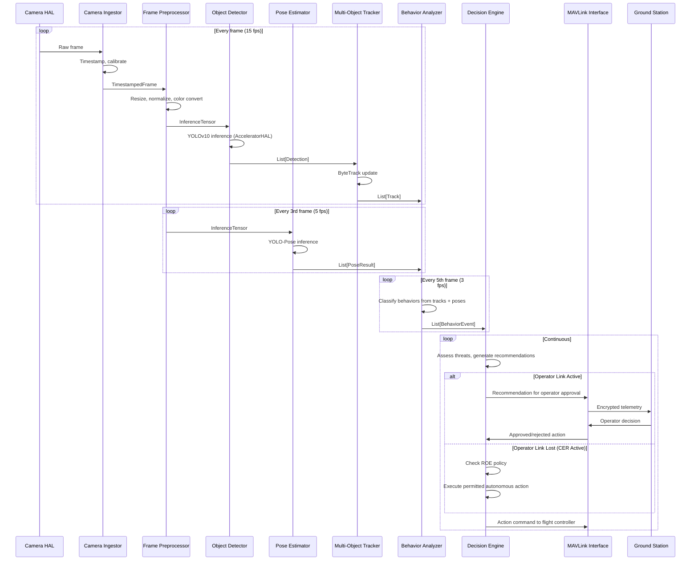
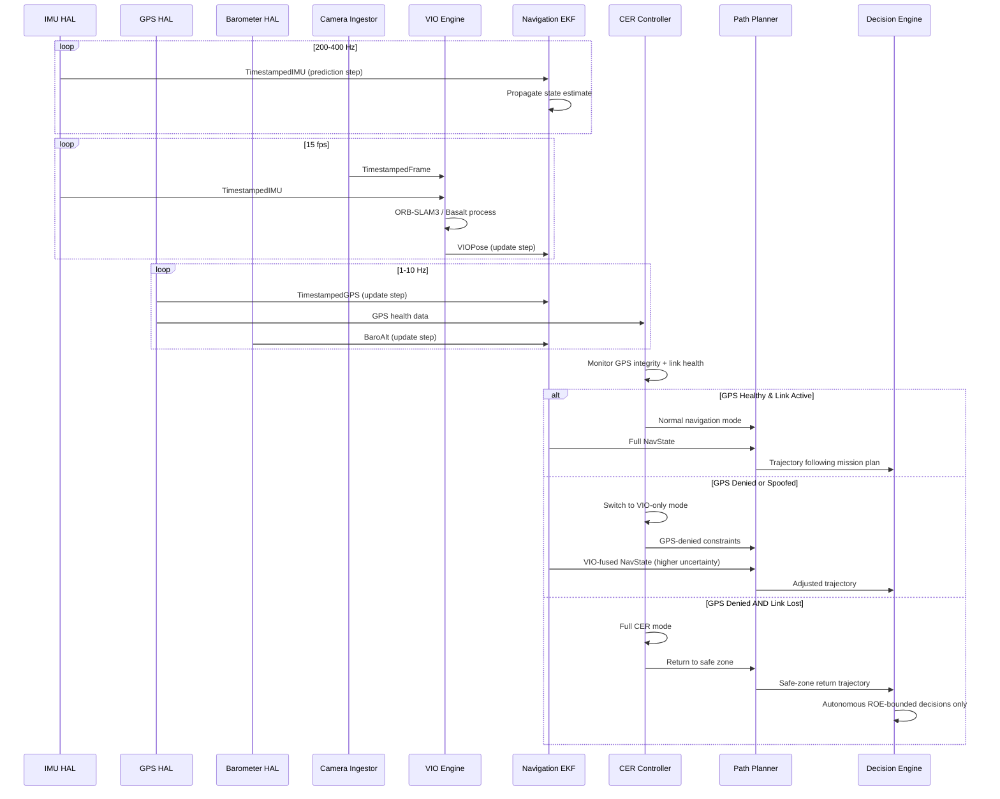
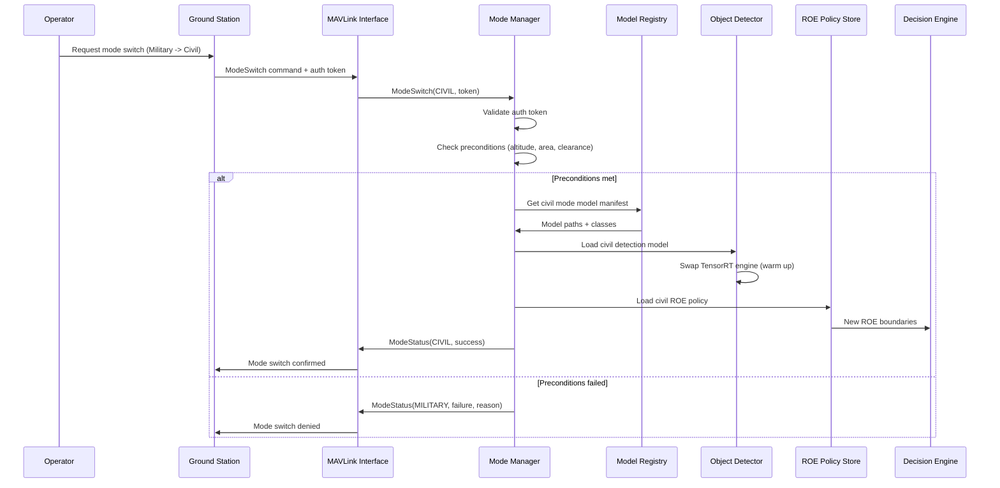

# Data Flow Diagrams

These sequence diagrams show exactly which module talks to which, in what order, and under what conditions. Read them top to bottom — each arrow is a message passed from one module to another.

## 3.1 Primary Frame Processing Pipeline

This is the main loop: a camera frame comes in, gets analyzed, and produces either an operator recommendation or an autonomous action.

**Key thing to notice**: three loops run at different speeds (15 fps, 5 fps, 3 fps) feeding into one continuous decision loop. This is the "deterministic scheduling" principle from the overview doc — expensive analysis runs less often without blocking the fast, cheap stuff.

---

## 3.2 Navigation Sensor Fusion Flow

This shows how GPS, IMU, camera, and barometer data combine into one position estimate — and what happens when GPS is jammed.

**Why IMU runs at 200-400 Hz while GPS runs at 1-10 Hz**: IMU (accelerometer + gyroscope) measures tiny, fast changes in motion — it needs to sample fast to keep the drone stable in flight. GPS gives an absolute position fix but updates slowly and can be jammed. The EKF uses IMU for the "predict" step every cycle and corrects drift with the slower, more reliable GPS/VIO "update" steps. This is the mathematical foundation of every modern autopilot.

---

## 3.3 Mode Switching Flow

This shows what happens when an operator switches from Military to Civil mode (or vice versa) mid-mission.

**Why an auth token is required**: Mode switching changes which ROE rules apply — civil mode should never accidentally have military-grade autonomous authority. Requiring authorization prevents accidental or unauthorized escalation.
