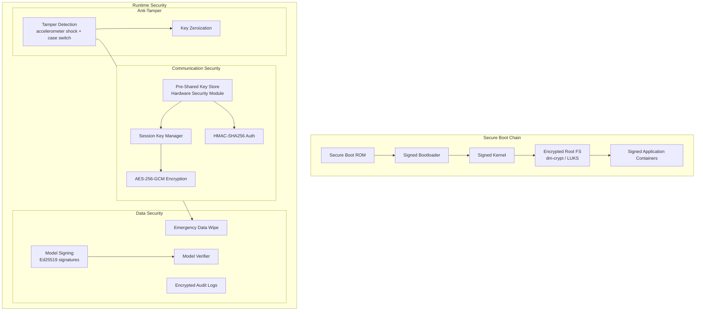

# Security Architecture

Security is not a bolt-on feature for this project — it's a core requirement. A surveillance drone that leaks its video feed, can be hijacked mid-flight, or has its AI models stolen after capture is worthless to a defense or law-enforcement customer.

## Threat Model

| Threat | Impact | Mitigation |
|---|---|---|
| RF link interception | Leaked intel, position exposure | AES-256-GCM encrypted telemetry |
| Command injection via MAVLink | Unauthorized flight control | Message authentication (HMAC-SHA256) |
| Physical capture of drone | Model/code extraction | Encrypted filesystem, secure boot, tamper detection |
| GPS spoofing | False position, lure into hostile territory | GPS integrity checking, VIO cross-validation |
| Model poisoning (supply chain) | Degraded detection accuracy | Model signing, hash verification at load time |
| Firmware tampering | Compromised flight controller | Signed firmware, boot attestation |

## Security Architecture Diagram



## Key Concepts Explained

### Secure Boot Chain

Every layer, from the chip's boot ROM up through the application containers, is cryptographically signed and verified before it runs. If any layer has been tampered with (e.g., an attacker flashes a modified kernel), the chain breaks and the device refuses to boot into a compromised state.

**Analogy**: It's like a wax seal on a letter, but at every layer — the envelope, the letter inside, and the letter's paragraphs all have their own seals. Break any seal and you know something was tampered with.

### AES-256-GCM (Advanced Encryption Standard, 256-bit key, Galois/Counter Mode)

The encryption algorithm used to scramble telemetry data so it's unreadable if intercepted. AES-256 is the same standard used by the US government for TOP SECRET data. "GCM" mode additionally provides authentication — meaning it not only hides the data but also proves it wasn't tampered with in transit.

### HMAC-SHA256 (Hash-based Message Authentication Code)

Used to authenticate MAVLink commands sent to the flight controller. Without this, an attacker could inject fake commands ("land now" or "fly toward this GPS coordinate") even without decrypting the traffic. HMAC ensures the flight controller only accepts commands signed with a secret key it trusts.

### Ed25519 Model Signing

Every AI model file (the weapon detector, the object detector) is cryptographically signed before deployment. When the drone loads a model, it verifies the signature first. This prevents a "supply chain attack" where someone swaps in a corrupted or backdoored model — for example, one that's trained to never detect a specific type of vehicle.

## Communication Encryption Protocol

All ground-station communication uses a layered protocol:

1. **Transport**: UDP (for telemetry) / TCP (for commands requiring reliability)
2. **Session**: Pre-shared symmetric key (AES-256), rotated per mission via key derivation (HKDF-SHA256 from master key + mission ID + timestamp)
3. **Message format**:
   ```
   [4B magic][4B seq_no][4B msg_type][4B payload_len][NB encrypted_payload][16B GCM_tag][12B nonce]
   ```
4. **Anti-replay**: Sequence number window (reject if seq_no < last_seen - 64 or already seen in window)
5. **MAVLink signing**: MAVLink v2 message signing with HMAC-SHA256 using a separate signing key

**Why key rotation per mission?** If a key were ever compromised, using it forever would expose every past and future mission. Deriving a fresh key per mission from a master key limits the blast radius of any single key leak.

**Why anti-replay protection?** Without it, an attacker who records an encrypted "return to base" command could replay it later to force an unwanted landing — even without ever decrypting it.

## Anti-Tamper Response

On tamper detection (accelerometer shock beyond flight profile, case-open switch, or manual trigger):

1. Zeroize all cryptographic keys from RAM and HSM
2. Initiate encrypted log upload burst (best-effort if link available)
3. Wipe model weights from flash storage
4. Enter inert mode (no further processing, flight controller continues basic RTL)

**Why wipe on capture instead of just encrypting?** Encryption protects data *in transit*. If the drone is physically captured, an adversary has unlimited time to attack the encryption. Wiping keys and models ensures that even a captured drone yields nothing useful — the flight controller still tries to fly home on basic autopilot logic, but the AI brain is empty.

## Implementation Priority

Security hardening (Feature 11) is scheduled *after* the core platform works end-to-end (Features 2-9). This is intentional — you cannot secure a system that doesn't exist yet, and building security in from day one on unstable architecture leads to rework. The MVP phases will use development-only defaults (unencrypted, unsigned) with clear `TODO: SECURITY` markers, then Feature 11 systematically closes every gap listed in the threat model table above.
