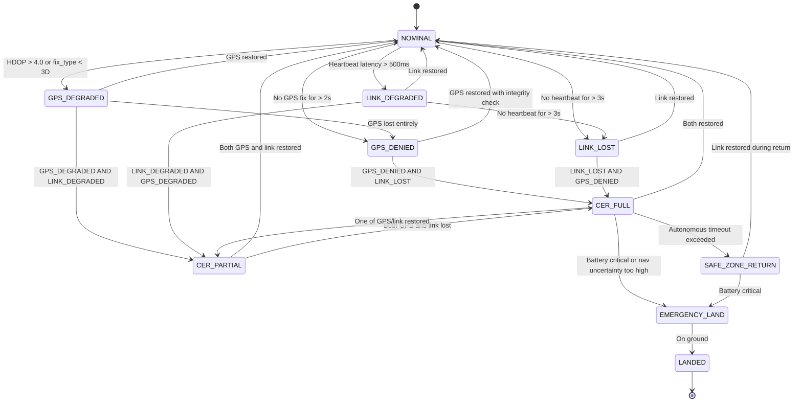

# CER Design — Cognitive Edge Resilience

CER is AerialMind's core differentiator: the ability to survive a "soft-kill" attack (GPS jamming and/or operator link jamming) without losing the mission or the drone.

## What is a Soft-Kill Attack?

Modern air defense systems rarely shoot drones down (a "hard kill"). Instead, they jam the drone's GPS signal and/or the radio link to its operator — a "soft kill." A standard drone responds to this by either:
- Drifting uncontrolled (GPS lost, no position reference)
- Immediately landing in place (safety fallback, often in hostile territory)
- Returning home blindly using dead-reckoning that drifts and misses

None of these outcomes are useful. CER is designed so the drone instead **keeps flying accurately, keeps completing its mission within bounds, and returns to safety on its own terms.**

## CER State Machine

**Reading this diagram**: The drone starts in `NOMINAL` (everything healthy). Degradation is tracked on two independent axes — GPS health and link health — because they can fail separately or together. Only when *both* are lost (`CER_FULL`) does the drone shift into fully autonomous survival behavior. This graduated response avoids overreacting to a brief GPS hiccup while still responding fast enough to a coordinated jamming attack.

## GPS Integrity Checking

Before trusting GPS at all, the system continuously runs five independent checks. Any single failure is suspicious; multiple failures trigger CER:

1. **Position jump detection**: If GPS position jumps more than `max_velocity * dt * 1.5` between fixes, flag as suspicious. A drone physically cannot teleport — a sudden jump means the GPS signal is being spoofed.

2. **VIO cross-validation**: Compare GPS-derived velocity with VIO-derived velocity (from the camera). If they disagree by more than 3 standard deviations for 5 consecutive fixes, declare GPS spoofed. This works because a spoofer can fake GPS signals but can't fake what the camera actually sees.

3. **HDOP monitoring** (Horizontal Dilution of Precision — a measure of GPS accuracy): Track HDOP trends. A sudden *improvement* in HDOP in an environment where jamming is expected is itself suspicious — real degraded GPS gets *worse* under jamming, not better. A sudden improvement often means a spoofer has taken over and is now feeding a clean, fake signal.

4. **Multi-constellation consistency**: If receiving both GPS and GLONASS (the Russian equivalent satellite system), cross-check for disagreement between the two. Spoofing both constellations simultaneously and consistently is much harder for an attacker.

5. **Clock drift analysis**: GPS satellites also broadcast precise time. Monitor GPS time vs. the drone's internal monotonic clock for anomalous drift — spoofed signals often have subtly wrong timing.

## VIO-Only Navigation (GPS-Denied Mode)

When GPS integrity checks fail, the Navigation EKF switches to VIO-primary fusion:

**VIO Pipeline (ORB-SLAM3)**:
1. Receive synchronized camera frames + IMU data
2. Extract ORB features (distinctive visual points — corners, edges) from the current frame
3. Match features against a locally-built map of the area
4. If sufficient matches: calculate camera pose via PnP (Perspective-n-Point, a standard computer vision pose-solving technique)
5. If insufficient matches (flying over new terrain): initialize a new map segment
6. IMU pre-integration between frames for high-rate pose prediction between camera frames
7. Local bundle adjustment every N keyframes (a refinement step that reduces accumulated error)
8. Output: 6-DoF pose (3D position + 3D orientation) at frame rate

**EKF Fusion in GPS-Denied Mode**:
- **Prediction**: IMU at 200-400 Hz (propagates position, velocity, attitude between updates)
- **Update sources** (in priority order):
  1. VIO pose (15 Hz) — primary position/attitude correction
  2. Barometric altitude (10 Hz) — constrains vertical drift
  3. Magnetometer heading (10 Hz) — constrains yaw drift (if not jammed)
- GPS update: disabled entirely when GPS integrity check fails
- Position uncertainty grows over time in GPS-denied mode — this is physically unavoidable (VIO alone drifts slowly without GPS to correct it). The `NavState.pos_uncertainty` field tracks this growth and feeds the CER controller's decision on when uncertainty is too high to continue the mission safely.

## Safe-Zone Return Algorithm

When `CER_FULL` triggers a return-to-safe-zone:

1. Query `SafeZoneManager` for all known safe zones (pre-programmed before the mission)
2. Filter by reachability (distance vs. remaining battery, accounting for headwinds)
3. Score remaining zones by: distance (lower is better), last-known threat level along the path (lower is better), landing suitability
4. Plan a trajectory to the highest-scoring zone using A* on a 3D occupancy grid (if terrain data is available) or a direct great-circle path with altitude hold
5. Execute via `PathPlanner` → MAVLink waypoint commands
6. Continuously re-evaluate: if link restores mid-return, signal the operator and await instructions; if battery drops below critical threshold, switch to emergency landing at the nearest flat area

## Why This Is Hard to Copy

Most commercial drone software treats GPS loss as a failure condition — "land now" or "hover and wait." Building genuine autonomous navigation requires:
- A working VIO pipeline tuned specifically for aerial (not ground robot) camera angles and vibration profiles
- An EKF that gracefully hands off between GPS and VIO without a jarring position "jump" that could destabilize the flight controller
- A rules engine (ROE) sophisticated enough that autonomous action is safe and legally defensible, not just "fly home and hope"

This combination — VIO + EKF handoff + ROE-bounded autonomy — is the technical moat. Anyone can integrate an off-the-shelf object detector. Very few have built a genuinely resilient navigation stack.
