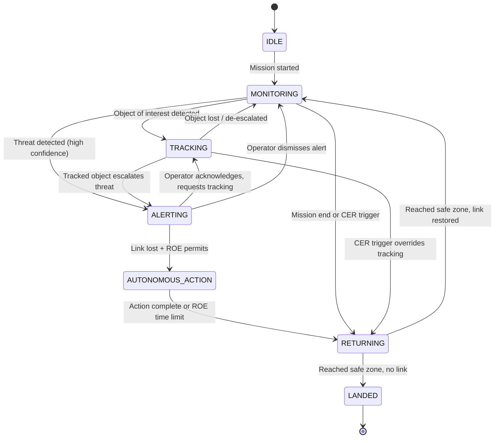

# Decision Engine Design

The Decision Engine is where perception (what the vision pipeline sees) turns into action (what the drone does). It is deliberately designed to be simple, rule-based, and fully auditable — every decision must be explainable to a human reviewing the mission afterward.

## Decision State Machine



**Note the priority**: a CER trigger (soft-kill detected) overrides `TRACKING` and forces `RETURNING` — the drone's own survival and safe return always takes precedence over continuing a mission when it's under attack.

## Threat Assessment Logic

The Threat Assessor computes a composite threat score (0-100) from multiple signals:

```
threat_score = w1 * weapon_detection_score
             + w2 * aggressive_behavior_score
             + w3 * crowd_density_anomaly_score
             + w4 * proximity_to_protected_asset_score
             + w5 * historical_pattern_score
```

Weights (`w1`-`w5`) are mode-dependent — military and civil scenarios care about different signals:

| Weight | Military Mode | Civil Mode | Why |
|---|---|---|---|
| w1 (weapon) | 0.35 | 0.20 | Weapon presence is the dominant signal in combat zones; in civil contexts it's serious but less common |
| w2 (aggressive behavior) | 0.25 | 0.30 | Street fights/road rage are primarily behavioral, not weapon-based |
| w3 (crowd anomaly) | 0.10 | 0.25 | Crowd dynamics matter far more for civil unrest/riot prevention |
| w4 (proximity to asset) | 0.20 | 0.15 | Protecting a military position is weighted more heavily than a civil target |
| w5 (historical pattern) | 0.10 | 0.10 | Equal weight — past behavior patterns matter in both contexts |

**Thresholds**:

| Score Range | Level | Response |
|---|---|---|
| < 30 | MONITORING (green) | Passive observation, no action |
| 30-60 | TRACKING (yellow) | Recommend closer observation |
| 60-80 | ALERTING (orange) | Recommend operator intervention |
| ≥ 80 | CRITICAL (red) | If disconnected and ROE permits, autonomous action |

## Human-in-the-Loop Protocol

This is how AerialMind honors the requirement that "AI should provide the best decision possible, but a human stays in the loop — just less involved than traditional remote piloting."

```mermaid
sequenceDiagram
    participant DE as Decision Engine
    participant RG as Recommendation Generator
    participant AAC as Autonomous Action Controller
    participant ROE as ROE Policy Engine
    participant LINK as Link Monitor
    participant OP as Human Operator

    DE->>RG: ThreatAssessment(level=ALERTING, ...)
    RG->>RG: Generate ranked recommendations
    RG->>AAC: Recommendation(action=TRACK_CLOSELY, priority=HIGH)

    AAC->>LINK: Query link status

    alt Link Active
        AAC->>OP: "Weapon detected NE sector, confidence 87%.<br/>Recommend: track and zoom. Approve? [Y/N/Modify]"
        OP->>AAC: APPROVE / REJECT / MODIFY
        alt Approved
            AAC->>DE: Execute TRACK_CLOSELY
        else Rejected
            AAC->>DE: Log rejection, continue MONITORING
        else Modified
            AAC->>DE: Execute modified action
        end
    else Link Lost
        AAC->>ROE: Can I execute TRACK_CLOSELY autonomously?
        ROE->>ROE: Check current ROE policy
        alt ROE Permits
            ROE->>AAC: PERMITTED (with constraints: max 120s, max 200m deviation)
            AAC->>AAC: Log: "Autonomous action under ROE rule A3.2"
            AAC->>DE: Execute TRACK_CLOSELY (constrained)
        else ROE Denies
            ROE->>AAC: DENIED
            AAC->>DE: Log denial, continue current safe behavior
        end
    end
```

**The key design decision**: when the link is active, the AI *never* acts without approval — it only recommends. When the link is lost, the AI can act, but only within pre-approved boundaries (ROE), never beyond them, and always with time/distance limits and full logging. This is what "human in the loop, but less" means in practice — the human sets the boundaries in advance (via ROE), and the AI operates freely *within* those boundaries only when it has no other choice.

## ROE (Rules of Engagement) Policy Format

ROE policies are YAML files, loaded at mission start, and cryptographically signed to prevent tampering:

```yaml
# roe_civil_standard.yaml
version: "1.0"
mode: civil
classification: UNCLASSIFIED

rules:
  - id: C1
    trigger: "threat_level >= ALERTING"
    action: TRACK_CLOSELY
    autonomous: true
    constraints:
      max_duration_sec: 120
      max_deviation_m: 200
      min_altitude_m: 30

  - id: C2
    trigger: "threat_level >= CRITICAL"
    action: ALERT_AUTHORITIES
    autonomous: true
    constraints:
      alert_channel: "emergency_services"
      include_coordinates: true
      include_video_snapshot: true

  - id: C3
    trigger: "threat_level >= CRITICAL AND battery_pct < 20"
    action: RETURN_TO_BASE
    autonomous: true
    constraints: null  # unconditional

  - id: C_DENY_1
    trigger: "any"
    action: ENGAGE_TARGET
    autonomous: false  # never autonomous in civil mode
    constraints: null

default_disconnected_behavior: CONTINUE_PATROL_ORBIT
max_autonomous_duration_sec: 600
safe_zones:
  - lat: 37.7749
    lon: -122.4194
    radius_m: 500
    label: "Base Station Alpha"
```

**Why `C_DENY_1` matters**: notice that the policy explicitly *denies* certain actions (`ENGAGE_TARGET`) rather than just omitting them. In a rule-based system, an explicit deny is a much stronger safety guarantee than "we didn't write a rule allowing it" — it's defense-in-depth against bugs in the policy engine itself.

## Why Rule-Based, Not Machine Learning?

It would be technically possible to train a neural network to make the final "should we act autonomously" decision. We deliberately do not do this for the MVP, for one critical reason:

**Explainability.** A defense or law-enforcement customer will ask, after every incident, "why did the drone do that?" With a rule-based engine, the answer is always: "ROE rule C1 triggered because threat_level reached ALERTING, and it was permitted because the link was lost and constraints were satisfied." This is auditable, defensible, and legally sound.

A machine-learning decision-maker cannot give this answer — it can only say "the model predicted this was the best action," which is not acceptable for autonomous decisions in life-and-death or civil-liberties contexts.

**Where ML *does* fit**: the vision pipeline (object detection, pose estimation, behavior classification) uses ML extensively — but ML there produces *evidence* ("weapon detected, 87% confidence"), and the rule-based engine converts that evidence into an *auditable decision*. This split is intentional: ML for perception, rules for action.
