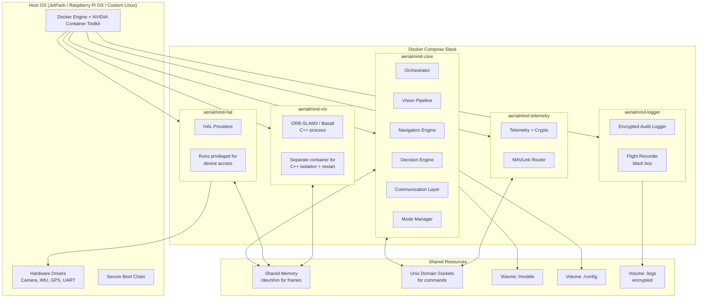

# Deployment Architecture

This doc covers how AerialMind actually gets installed on a physical drone's companion computer, and how it's structured to be easy to deploy and maintain across many different drone platforms — which is the project's core "ease of deployment" USP.

## Why Docker?

Docker packages the software plus all its dependencies into a portable "container" that runs identically regardless of the underlying Linux system. For AerialMind this means:

- The exact same container image runs on a Jetson Orin Nano, a Raspberry Pi 5, or a custom defense compute module
- Updates are just "pull a new image" — no manual dependency wrangling on each drone
- A crashing component (e.g., the VIO process) restarts in isolation without taking down the whole system
- NVIDIA officially supports Docker on Jetson (via JetPack + NVIDIA Container Toolkit), so this isn't a workaround — it's the standard way to deploy AI workloads on their hardware

## Container Structure



## Why 5 Separate Containers Instead of 1?

| Container | Purpose | Why isolated |
|---|---|---|
| `aerialmind-hal` | Talks directly to hardware | Needs `privileged` mode for device access — isolating this limits the blast radius if compromised |
| `aerialmind-core` | Vision + Navigation + Decision + Mode logic | The main "brain" — needs GPU access |
| `aerialmind-vio` | ORB-SLAM3 C++ process | Complex C++ memory management; isolating it means a VIO crash doesn't take down vision/decision logic — it just restarts |
| `aerialmind-telemetry` | MAVLink + encrypted comms | Network-facing — isolating limits exposure if the network stack has a vulnerability |
| `aerialmind-logger` | Encrypted audit trail | Runs independently so logging survives even if other containers crash |

## Container Resource Allocation

| Container | Base Image | Resources | Privileges | Restart Policy |
|---|---|---|---|---|
| `aerialmind-hal` | `nvcr.io/nvidia/l4t-base` | 1 CPU core, 256MB RAM | `privileged` (device access) | `always` |
| `aerialmind-core` | `nvcr.io/nvidia/l4t-ml` | 2 CPU cores, 2GB RAM, GPU | `runtime: nvidia` | `always` |
| `aerialmind-vio` | Custom C++ image | 1 CPU core, 512MB RAM | none | `on-failure:5` |
| `aerialmind-telemetry` | `python:3.11-slim` | 0.5 CPU core, 128MB RAM | none | `always` |
| `aerialmind-logger` | `python:3.11-slim` | 0.25 CPU core, 64MB RAM | none | `always` |

## Inter-Container Communication

- **Frame data**: Shared memory (`/dev/shm`) for zero-copy frame passing. At 1280x720x3 pixels @ 30 fps, raw frame data is ~83 MB/s — serializing this through network sockets would waste CPU that's needed for AI inference. A lock-free ring buffer with atomic sequence counters lets containers share frames with near-zero overhead.
- **Command/control**: Unix domain sockets with protobuf-serialized messages — low latency, no network stack overhead, but still process-isolated (unlike raw shared memory for structured data).
- **Logging**: All containers write to a shared logging socket consumed by `aerialmind-logger`.

## The Installation Flow (This Is the Product Demo)

```
1. OEM ships drone with base OS + Docker pre-installed
2. AerialMind installer:
   a. Pulls container images from private registry (or loads from USB for air-gapped installs)
   b. Runs hardware discovery to auto-generate hal_config.yaml
   c. Compiles AI models to the detected accelerator's format (one-time, cached)
   d. Deploys docker-compose.yaml + config
   e. Registers a systemd service for auto-start on boot
3. Updates:
   a. New container images pulled/loaded
   b. Blue-green deployment: new stack starts, health check passes, old stack stops
   c. Rollback: if health check fails within 60s, automatically revert to previous images
   d. Model updates: new model files dropped into /models volume, hot-reload triggered — no restart needed
```

**Why this matters for sales**: this installation flow is designed to be a single command (`aerialmind-installer --auto-detect`) that works on hardware the installer has never seen before. When pitching to a drone manufacturer, this is the moment that sells the product — plug in the compute module, run one command, and within minutes you have a working AI-powered surveillance drone. That "5-minute install on unfamiliar hardware" experience is the entire point of the Hardware Abstraction Layer investment.

## Hardware Abstraction Layer Configuration

Each target platform ships with its own `hal_config.yaml` describing exactly what hardware is present:

```yaml
# hal_config.yaml -- Jetson Orin Nano profile
platform: jetson_orin_nano
camera:
  provider: csi
  width: 1280
  height: 720
  fps: 30
  format: NV12
accelerator:
  provider: tensorrt
  precision: fp16
  max_batch_size: 1
  workspace_mb: 512
  model_cache_dir: /opt/aerialmind/model_cache
imu:
  provider: serial
  device: /dev/ttyTHS1
  baudrate: 921600
  sample_rate_hz: 400
gps:
  provider: serial
  device: /dev/ttyTHS0
  baudrate: 115200
```

The hardware discovery service (part of `aerialmind-hal`) can auto-generate this file on first boot by probing for CUDA devices, checking `/dev/video*` nodes, and scanning serial ports — meaning even a first-time install on brand-new hardware requires zero manual configuration in the common case.
